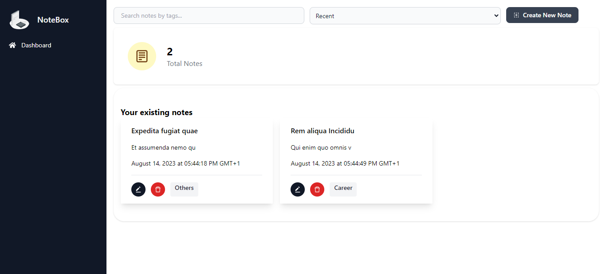
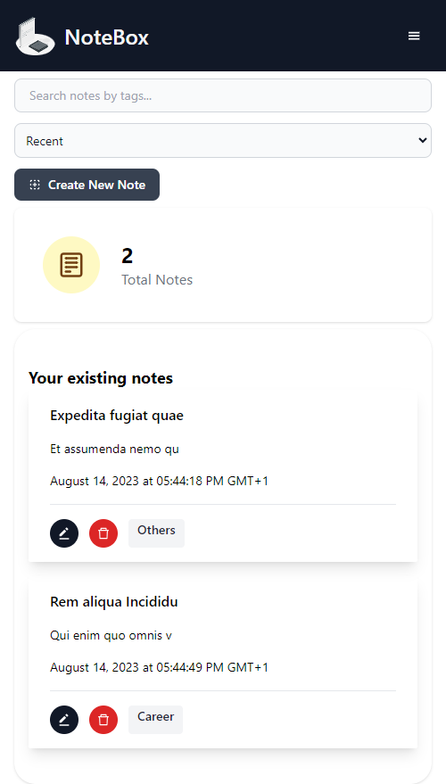

# My NoteBox

Welcome to **My NoteBox**! This is a simple web application for creating, managing, and organizing your notes.

[Link To Demo](https://notebox.brimble.app)

## Features

- Create new notes with a title, content, and optional tags.
- Edit and update notes.
- Delete unwanted notes.
- Sort notes by recency, last hour, last day, or oldest.
- Search notes by tags
- Responsive design, works well on desktop and mobile devices.
- Minimalist and user-friendly interface.

### Desktop View

### Mobile View

## Technologies Used

- React + Vite: A popular JavaScript library for building user interfaces.
- Local Storage: Used to store notes data locally in the browser.
- Tailwind CSS: A utility-first CSS framework for fast and responsive UI development.
- Brimble: A Nigeria owned Platform as a service for deployment
